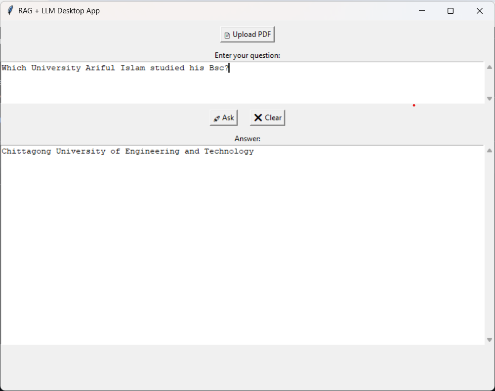

# RAG + LLM Desktop App

This is a desktop application that integrates Retrieval-Augmented Generation (RAG) with a Large Language Model (LLM). It allows users to upload a PDF document and ask questions, and the app provides answers based on both the uploaded document and the pretrained knowledge of the LLM.

---

## 🔧 Features

- Upload any PDF
- Ask natural language questions
- Get accurate answers using RAG pipeline
- Simple and lightweight desktop GUI

---

## 🚀 How to Use

1. **Run the application**.
2. Click **"Upload PDF"** to select the document.
3. Type your question in the input box labeled “Enter your question:”.
4. Click **"Ask"** to get the answer generated by the model.
5. Use the **"Clear"** button to reset the input and output boxes.

---

## 📸 Screenshot

Below is a sample screenshot of the application in use:

---

## 🛠️ Built With

- Python
- LangChain / LLMs
- PyMuPDF for PDF parsing
- Tkinter 
